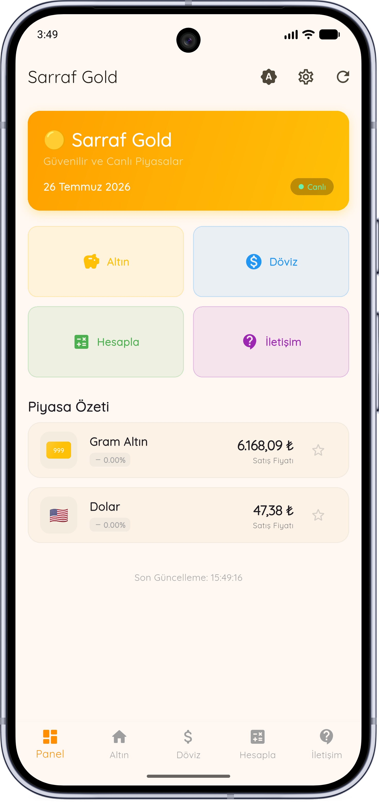
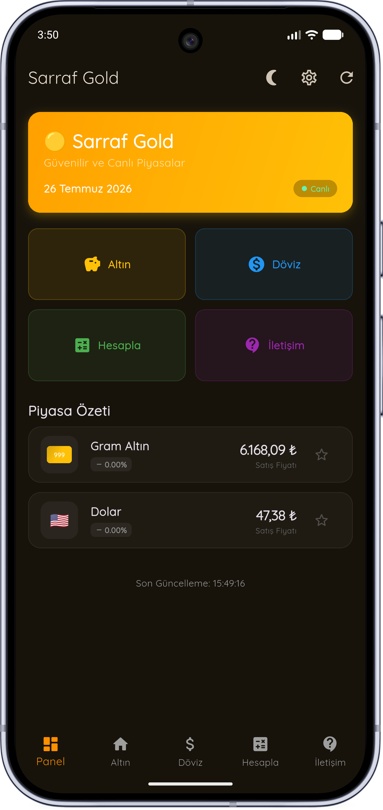
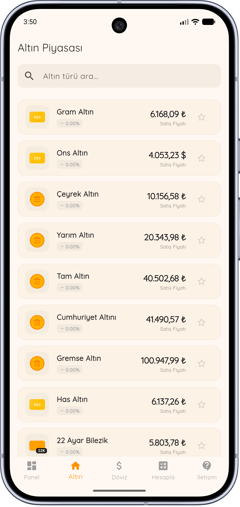
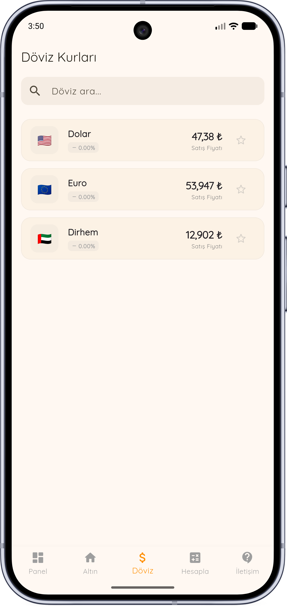
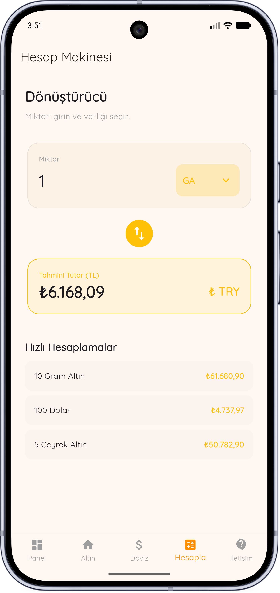
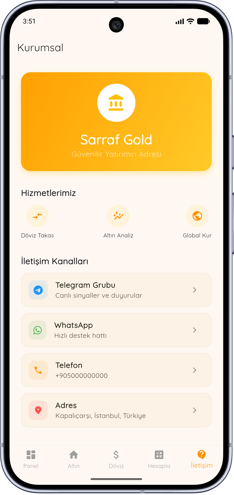

# 🪙 Sarraf Gold

Sarraf Gold is a Flutter application offering a straightforward interface for users to access live gold prices and currency exchange rates. The app aims to provide quick and easy access to market information and is available for Android and Web platforms.

## Key Features

- Real-time gold prices
- Current currency exchange rates
- Integrated calculator for gold and currencies
- Ability to save favorite prices
- Light and dark mode options
- Offline data caching
- Automatic checks for new APK updates
- Support for Android and Web

## Screenshots

<div align="center">





<br>

<b>Main Dashboard</b> • <b>Dark Mode</b> • <b>Gold Prices</b>

<br><br>





<br>

<b>Currency Exchange</b> • <b>Calculator</b> • <b>Contact</b>

</div>

## Languages & Technologies Used

- Flutter
- Dart
- Provider
- Shared Preferences
- GenelPara API

## Supported Platforms

- Android
- Web
- Windows (WIP)

## Installation

### Android

The latest APK can be downloaded from the Releases page:

[Download Latest APK](https://github.com/exirains/sarraf-gold/releases)

### Web

To build the web version, use the following command:

```bash
flutter build web
```

## Development

To clone the repository, run:

```bash
git clone https://github.com/exirains/sarraf-gold.git
```

Install project dependencies with:

```bash
flutter pub get
```

To run the application locally:

```bash
flutter run
```

## Update Mechanism

Sarraf Gold features an update checker. It monitors GitHub Releases for new APK versions and prompts users when an update becomes available.

## Data Source

Market data is sourced from GenelPara API.

## License

This project is intended for personal and educational purposes.
